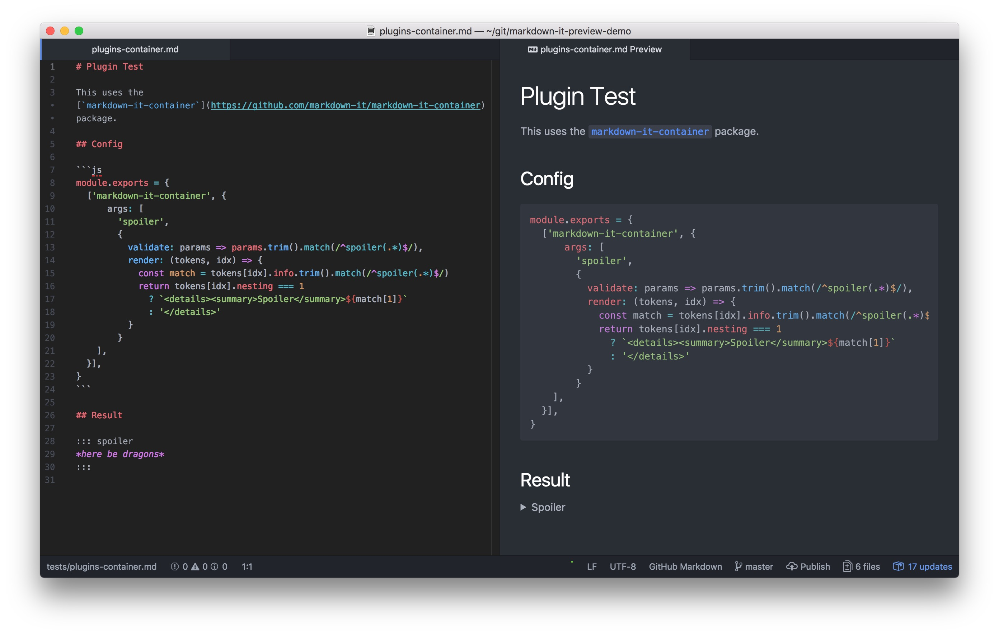

# Plugin Test

This uses the [`markdown-it-container`](https://github.com/markdown-it/markdown-it-container) package.

## Config

```js
module.exports = {
  ['markdown-it-container', {
      args: [
        'spoiler',
        {
          validate: params => params.trim().match(/^spoiler(.*)$/),
          render: (tokens, idx) => {
            const match = tokens[idx].info.trim().match(/^spoiler(.*)$/)
            return tokens[idx].nesting === 1
              ? `<details><summary>Spoiler</summary>${match[1]}`
              : '</details>'
          }
        }
    ],
  }],
}
```

## Result

::: spoiler
*here be dragons*
:::

## Screenshot


