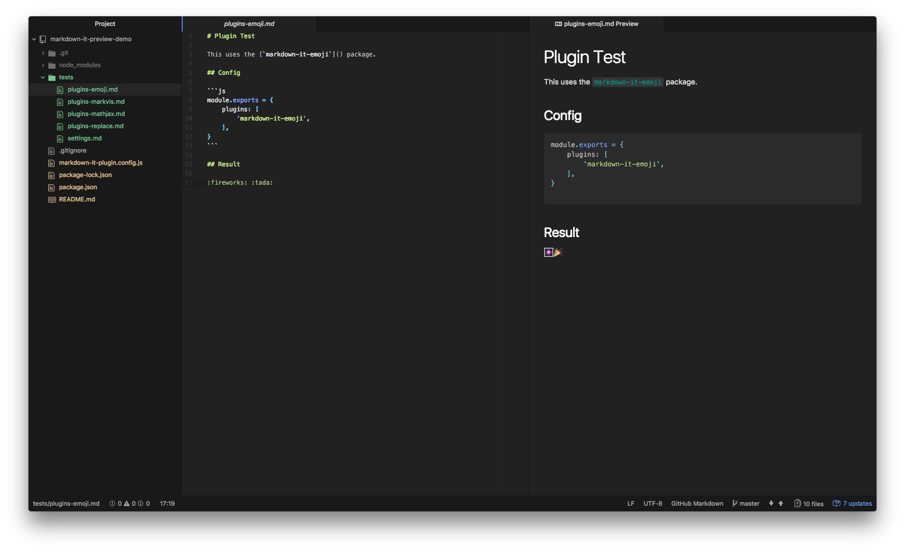

# Plugin Test

This uses the [`markdown-it-emoji`](https://github.com/markdown-it/markdown-it-emoji) package.

## Config

```js
module.exports = {
    plugins: [
        'markdown-it-emoji',
    ],
}
```

## Result

:fireworks: :tada:

## Screenshot

