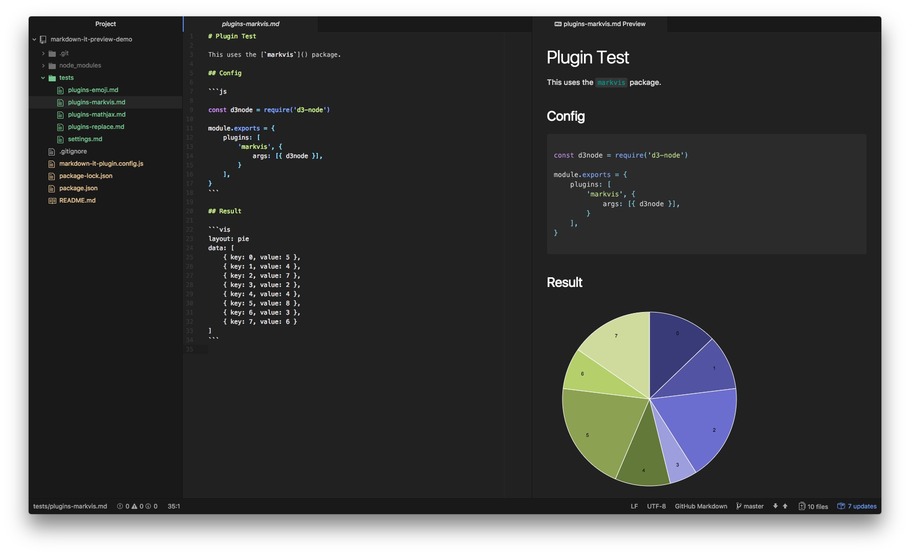

# Plugin Test

This uses the [`markvis`](https://github.com/geekplux/markvis) package.

## Config

```js

const d3node = require('d3-node')

module.exports = {
    plugins: [
        'markvis', {
            args: [{ d3node }],
        }
    ],
}
```

## Result

```vis
layout: pie
data: [
    { key: 0, value: 5 },
    { key: 1, value: 4 },
    { key: 2, value: 7 },
    { key: 3, value: 2 },
    { key: 4, value: 4 },
    { key: 5, value: 8 },
    { key: 6, value: 3 },
    { key: 7, value: 6 }
]
```

## Screenshot

