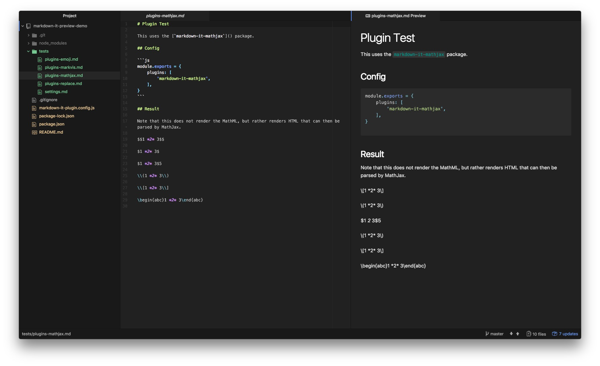

# Plugin Test

This uses the [`markdown-it-mathjax`](https://github.com/classeur/markdown-it-mathjax) package.

## Config

```js
module.exports = {
    plugins: [
        'markdown-it-mathjax',
    ],
}
```

## Result

Note that this does not render the MathML, but rather renders HTML that can then be parsed by MathJax.

$$1 *2* 3$$

$1 *2* 3$

$1 *2* 3$5

\\(1 *2* 3\\)

\\[1 *2* 3\\]

\begin{abc}1 *2* 3\end{abc}

## Screenshot

