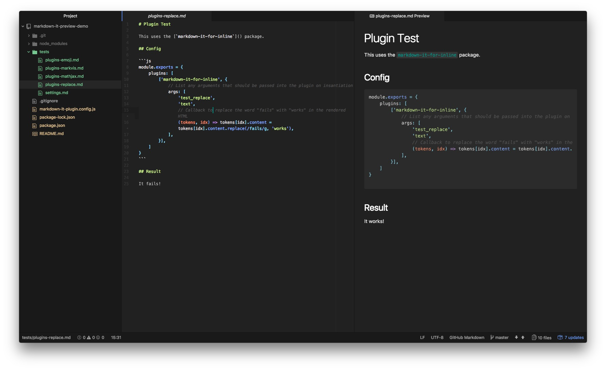

# Plugin Test

This uses the [`markdown-it-for-inline`](https://github.com/markdown-it/markdown-it-for-inline) package.

## Config

```js
module.exports = {
    plugins: [
        ['markdown-it-for-inline', {
            // List any arguments that should be passed into the plugin on insantiation
            args: [
                'test_replace',
                'text',
                // Callback to replace the word "fails" with "works" in the rendered HTML
                (tokens, idx) => tokens[idx].content = tokens[idx].content.replace(/fails/g, 'works'),
            ],
        }],
    ]
}
```

## Result

It fails!

## Screenshot

